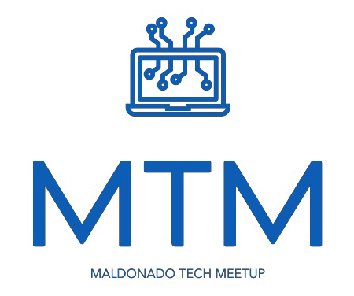

### Maldonado Tech Meetup:

Maldonado Homebrew Computer Club desde en adelante `MTM` surge de la necesidad local de un espacio de conectividad horizontal de apasionados y profesionales de la Tecnología de la Información cuya misión es construir una comunidad de profesionales, estudiantes y aficionados de las distintas ramas de las TIC´s.

El objetivo principal de `MTM` es incentivar el intercambio de conocimientos, experiencias y habilidades a través de reuniones, capacitaciones y eventos sociales que se llevarán a cabo regularmente, logrando el enriquecimiento, actualización y expansión permanente de los conocimientos de los miembros de la comunidad.

**¿Por qué participar en MTM?** 
`MTM` busca acelerar e impulsar los procesos de negocio en una comunidad activa de interesados por las TIC´s en el departamento de Maldonado posicionando al departamento de Maldonado y la región como buenos proveedores de servicios para el resto del país y el exterior.

**¿Quiénes pueden ser miembros de MTM?** 

Pueden participar profesionales, estudiantes, empresas, emprendedores, organizaciones y instituciones educativas que tengan interés y relación con las Tecnologías de la Información y Comunicación.

Los encuentros de la la comunidad serán comunicados entre sus miembros en las distintas plataformas de comunicación.

Unete en nuestra comunidad [Meetup](https://www.meetup.com/es/Maldonado-New-Technology-Meetup).

