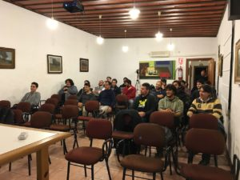

El viernes 30 de septiembre (2016) hicimos el primer meetup de mhcc en el local de [CEI](http://www.cei.edu.uy/web/).
Bajo nuestro antiguo nombre un tanto más friki `Maldonado Homebreaw Computer Club`.

### Los Speakers

Aparte de tomar un par de cafés tuvimos dos charlas técnicas, la primera de Santiago Regusci que nos hablo de micro contenedores y la segunda de Juan Manuel Pereyra que nos hablo de “loggeo” en AWS.

Unas charlas muy interesantes que nos mostraron un poco la realidad del desarrollo en la actualidad y como manejar grandes cantidades de entradas de logs para asi detectar los potenciales problemas antes de que los usuarios los comiencen a experimentar.

Luego de las dos charlas se dió un espacio de camadería en dónde intercambiamos experiencias, dudas particulares con lo planteado en las charlas y algún que otro chiste.

Ahh y mas café, obvio!

Una excelente jornada con buena participación lo que demuestra que hay mucha gente que trabaja en tecnología en Maldonado.