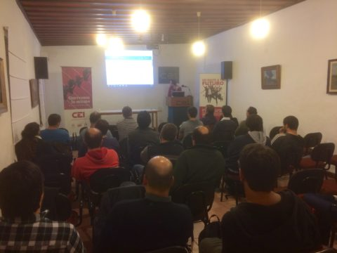

El pasado lunes 8 de Mayo (2017) se tuvo el agrado de realizar el segundo meetup de `Maldonado Homebrew Computer Club` con el renovado nombre de **Maldonado Tech Meetup** y, por segunda oportunidad, en el edificio del CEI de Arturo Santana y San Carlos, en Maldonado.

A pesar de que el clima no acompañó, los asistentes no se percataron demasiado y se convocaron en buen número a las instalaciones del [CEI](http://www.cei.edu.uy/web/).

### Los Speakers

En esta oportunidad, se contó con la presencia y exposición de Marcelo Duarte, ex CEO de HPS Gaming y actual CEO de Rimbos, cuyo tema principal fue la cómo validar una idea de negocio a nivel internacional, enfocado al caso de las startups tecnológicas.

En dicha exposición, Marcelo hizo énfasis en la importancia de validar las ideas y modelos de negocio previo a la venta de servicios y productos, de manera de minimizar los riesgos de fracaso de los proyectos y aumentar las chance de éxito en su implementación.

Antes y después de la exposición, se tuvo una instancia de charla y conocimiento entre los participantes, café y sándwiches mediante.

De esta manera transcurrió la segunda edición del Maldonado Tech Meetup, la cual esperamos continúe creciendo en cada edición, convocando a todos los actores del sector tecnológico Maldonado y el este del país.

Por contacto para colaboración, participación, consultas, etc., pueden escribirnos a info@mhcc.uy

Los esperamos para la tercera edición!!!