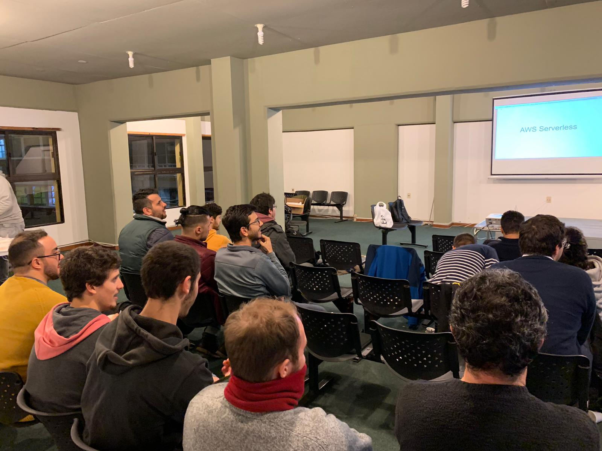
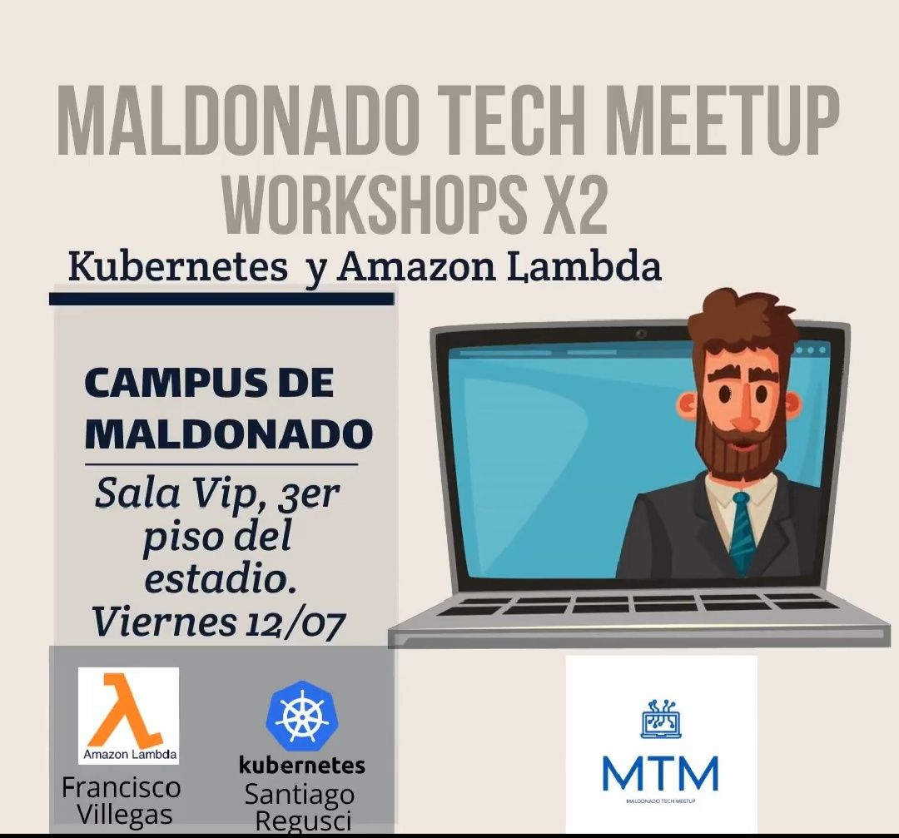

### Workshop práctico sobre aplicaciones serverless en AWS y Kubernetes 💻

Dos Workshop más que interesantes, tuvimos dos opciones tecnológicas casi antagónicas presentadas por nuestros compañero Santiago Regusci y Francisco Villegas.

Primero Kubernetes donde Santiago nos presentó los fundamentos tecnológicos, casos de usos más comunes y los comandos básico para familiarizarnos con la tecnología.
Aquí les dejamos un link donde pueden seguir la práctica en [GitHub](https://github.com/santicomp2014/taller_mtm_k8s)

Con Francisco hicimos nuestra app para recibir recetas de empanadas usando 100% AWS para hostear nuestra web, guardar las imágenes con S3, tambien nuestra base on cloud y lo más importante los serveless y sus triggers.
Una opción con infinidad de aplicación y en pleno auge.

Como es costumbre continuamos la charla con él con el infaltable café y unos sandwiches ☕☕🥪

Agradecemos a nuestros compañero por su tiempo para preparar y dar este workshop y a la Intendencia Departamental de Maldonado por habernos brindado el espacio asi como a todos los participantes!

Los esperamos en la próxima el Viernes 06 de Agosto Y no olviden seguirnos en [MeetUp](https://www.meetup.com/es/Maldonado-New-Technology-Meetup/) para recibir las notificaciones de la comunidad.

